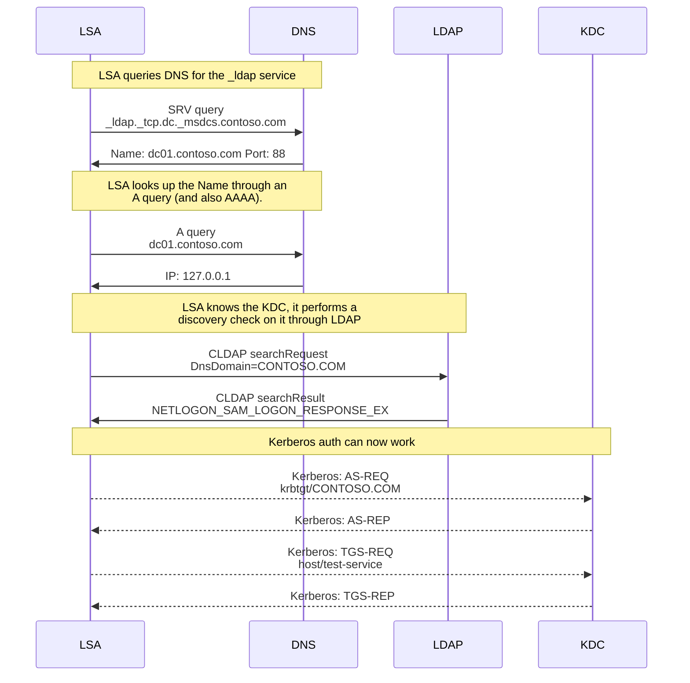

# Local KDC for Windows
This is an example program that can run a Kerberos Key Distribution Center (KDC) on a Windows host and have Windows authenticate to that without joining it to a domain.
The code in here is a proof of concept and does not cover all use cases.

## How It Works
Contrary to popular belief, Windows does not need to be joined to a domain to work with Kerberos authentication.
If provided with enough information it can attempt to locate the KDC and request the TGT and service ticket from it.
For example if someone attempts to access the fileshare `\\server\share` with the credential `user@contoso.com` Windows will attempt to find the KDC for the realm `contoso.com`.

The DC locator process is documented [here](https://learn.microsoft.com/en-us/troubleshoot/windows-server/active-directory/how-domain-controllers-are-located) but I've found that either not all the information is shared or is slightly different in real life.
Based on my investigations I've found this is what happens.

+ Windows sends a DNS query for the `SRV` record `_ldap._tcp.dc._msdcs.{realm}`
  + `{realm}` is replaced by the realm in question, for example `_ldap._tcp.dc._msdcs.contoso.com`
  + There does seem to be a fallback for `_kerberos._tcp.dc._msdcs.{realm}` but the `_ldap` service is always checked first
+ Windows sends an unauthenticated LDAP search request over UDP to retrieve the domain info
  + This is covered in more details under [LDAP Ping](https://learn.microsoft.com/en-us/openspecs/windows_protocols/ms-adts/895a7744-aff3-4f64-bcfa-f8c05915d2e9)
  + The search request filter is in the form of `(&(DnsDomain=...)(DnsHostName=...)(Host=...)(NtVer=...))`
  + The `DnsDomain` is the realm being requested
  + The `Host` is the client's Netbios hostname
  + The `DnsHostName` is the client's DNS hostname
  + The `NtVer` is a 32-bit integer flags for [NETLOGON_NT_VERSION Options](https://learn.microsoft.com/en-us/openspecs/windows_protocols/ms-adts/8e6a9efa-6312-44e2-af12-06ad73afbfa5)
+ The LDAP server replies with a single result with a single attribute called `Netlogon` containing the domain info
  + The `NtVer` in the request shapes what data structure is returned
  + On modern systems it is [NETLOGON_SAM_LOGON_RESPONSE_EX](https://learn.microsoft.com/en-us/openspecs/windows_protocols/ms-adts/8401a33f-34a8-40ca-bf03-c3484b66265f)

Once validated Windows will then use the host returned by the `SRV` record as the KDC for Kerberos authentication.

When running a local KDC we have all the tools necessary to configure Windows to use a locally running KDC for Kerberos authentication.
The `LocalKdc` C# project in this repo runs a DNS, LDAP, and KDC service on localhost and configures the DNS Name Resolution Policy Table (NRPT) to redirect and DNS queries for our `realm` to the local DNS service.
From there when attempting to authenticate with Kerberos to our realm, Windows will go through the DC locator process with our custom service which just points back to localhost.

The DNS NRPT setup is what allows us to point Windows to our local DNS server when querying a custom namespace.
The PowerShell cmdlet [Add-DnsClientNrptRule](https://learn.microsoft.com/en-us/powershell/module/dnsclient/add-dnsclientnrptrule?view=windowsserver2022-ps) can be used to create these rules manually but this program will do so automatically.

```powershell
Add-DnsClientNrptRule -Namespace contoso.test, .contoso.test -NameServers 127.0.0.1
```

If there is any DNS query for `contoso.test` or hosts under `.contoso.test`, Windows will use the DNS server at `127.0.0.1` to resolve the query.

Here are the network steps involved when SSPI tries to authenticate with `user@contoso.com` to the service `host/test-service`:



All of the communication except with the KDC is done over a UDP socket, the KDC communication is done over TCP here.
The `dc01.contoso.com` host returned in the SRV can point to `localhost` directly but to work with binding against a different network adapter we return the fake hostname with an `A` record pointing that hostname to our bound listener.

## Running
This requires the .NET 8.0 SDK to build and the .NET 8.0 runtime to run.
To build simply run `powershell -File build.ps1` or build it like any other dotnet project.

To run the server components you can run the `LocalKdc.exe` which will start the DNS, LDAP, and KDC service for `contoso.com`:

```powershell
# Will bind to 127.0.0.1
. ".\bin\LocalKdc\$env:PROCESSOR_ARCHITECTURE\LocalKdc.exe"

# Will bind to 169.254.13.1
. ".\bin\LocalKdc\$env:PROCESSOR_ARCHITECTURE\LocalKdc.exe" 169.254.13.1
```

The console will display two messages showing the DNS and LDAP server are up and running and any subsequent logs as it runs.

```
00:18:30 info: LocalKdc.DnsServer[0] Starting UDP listener on 127.0.0.1:53
00:18:30 info: LocalKdc.LdapServer[0] Starting UDP listener on 127.0.0.1:389
```

By default the service will bind to `127.0.0.1` but when providing another argument, the service will bind to that address instead.
In the above example, `169.254.13.1` is the IP for a loopback network adapter installed separately.

When the service is running you can test the Kerberos client authentication by running `LocalKdc.exe test` in another shell while the server is running:

```powershell
. ".\bin\LocalKdc\$env:PROCESSOR_ARCHITECTURE\LocalKdc.exe" test
```

```
00:20:09 info: LocalKdc.SspiClient[0] Starting client Kerberos test with user@CONTOSO.COM -> host/test-service.contoso.com
00:20:09 info: LocalKdc.SspiClient[0] Calling AcquireCredentialsHandleW
00:20:09 info: LocalKdc.SspiClient[0] AcquireCredentialsHandleW returned 0
00:20:09 info: LocalKdc.SspiClient[0] Calling InitializeSecurityContextW
00:20:09 info: LocalKdc.SspiClient[0] InitializeSecurityContextW returned 0
00:20:09 info: LocalKdc.SspiClient[0] Return Flags ISC_RET_ALLOCATED_MEMORY, Token 6082028C06092A86488...
```

The `Token` displayed is the hex encoding of the service ticket returned by the KDC.

## Troubleshooting
There are a few moving parts in this process so it can be helpful to verify each component when troubleshooting issues.

To verify that DNS is configured use the [Get-DnsClientNrptRule](https://learn.microsoft.com/en-us/powershell/module/dnsclient/get-dnsclientnrptrule?view=windowsserver2022-ps) and [Resolve-DnsName](https://learn.microsoft.com/en-us/powershell/module/dnsclient/resolve-dnsname?view=windowsserver2022-ps) cmdlets.

```powershell
# Verify realm is in Namespace and the NameServers point to 127.0.0.1
Get-DnsClientNrptRule

# Name                             : {2B1B126E-8C6C-45C2-B1BA-7A20D4287D86}
# Version                          : 2
# Namespace                        : {contoso.com, .contoso.com}
# IPsecCARestriction               :
# DirectAccessDnsServers           :
# DirectAccessEnabled              : False
# DirectAccessProxyType            :
# DirectAccessProxyName            :
# DirectAccessQueryIPsecEncryption :
# DirectAccessQueryIPsecRequired   :
# NameServers                      : 127.0.0.1
# DnsSecEnabled                    : False
# DnsSecQueryIPsecEncryption       :
# DnsSecQueryIPsecRequired         :
# DnsSecValidationRequired         :
# NameEncoding                     : Disable
# DisplayName                      :
# Comment                          :

# Verify we can resolve the DC locator SRV record
Resolve-DnsName -Name _ldap._tcp.dc._msdcs.contoso.com -Type SRV

# Name                             Type TTL Section NameTarget       Priority
# ----                             ---- --- ------- ----------       --------
# _ldap._tcp.dc._msdcs.contoso.com SRV  600 Answer  dc01.contoso.com 0

# Verify we can resolve the NameTarget to 127.0.0.1
Resolve-DnsName -Name dc01.contoso.com -Type A

# Name              Type   TTL   Section    IPAddress
# ----              ----   ---   -------    ---------
# dc01.kdc.test     A      3600  Answer     127.0.0.1
```

Once we have verified that DNS is working we can test out the LDAP Ping by using [nltest.exe](https://learn.microsoft.com/en-us/previous-versions/windows/it-pro/windows-server-2012-r2-and-2012/cc731935(v=ws.11)).

```powershell
nltest /dsgetdc:contoso.com /force

#            DC: \\dc01.contoso.com
#       Address: \\127.0.0.1
#      Dom Guid: cbc44175-b36d-4ea1-9281-66b5f359560e
#      Dom Name: contoso.com
#   Forest Name: contoso.com
#  Dc Site Name: Default-First-Site-Name
# Our Site Name: Default-First-Site-Name
#         Flags: PDC GC DS LDAP KDC TIMESERV GTIMESERV WRITABLE DNS_DC
#                DNS_DOMAIN DNS_FOREST CLOSE_SITE FULL_SECRET WS DS_8 DS_9
#                DS_10 KEYLIST DS_13
# The command completed successfully
```

Using `nltest /dsgetdc` will perform the DNS checks that were verified above but will also do the LDAP Ping check and verify the results returned by the service.
In the above example we can see that the `Address` for the DC is seen as `127.0.0.1` and the `Flags` indicate that is can be used as a `KDC`.

Once the above works then Windows should be able to contact the KDC like normal and get the service ticket.
If there are any more failures you'll have to use a tool like Wireshark to inspect the network traffic and look into Kerberos logging to figure out why it didn't work.

A common error to get back from the client test is

```
01:47:22 info: LocalKdc.SspiClient[0] InitializeSecurityContextW returned -2146893039
Unhandled exception. System.ComponentModel.Win32Exception (0x80090311): No authority could be contacted for authentication.
```

You can use the logging of the server side executable to see if there were any DNS or LDAP requests but ultimately this means that LSA failed to find KDC to use for authentication.

One problem is that LSA will cache the result of a KDC lookup and will continue to use that for 10 minutes before trying again.
This means if it retrieved the wrong name/IP from DNS for the realm it'll continue to use that until the timeout has succeeded.
The same also applies for a successful KDC lookup, if it found the KDC at a name, it'll continue to use that regardless if the local DNS records changed during testing.

It is possible to disable the cache or just lower the timeout from 10 minutes to a lower number by setting the registry property `FarKdcTimeout`.
To disable the cache set the value to `0`, otherwise the number represents the minutes before retrying the KDC lookup.
Use the below PowerShell code to remove the cache altogether or reset the timeout back to the default of 10 minutes.

```powershell
# Disables the cache by setting the prop to 0
$keyPath = 'HKLM:\SYSTEM\CurrentControlSet\Control\Lsa\Kerberos\Parameters'
New-ItemProperty -Path $keyPath -Name FarKdcTimeout -Value 0 -Type DWord -Force

# Reset back to the default
Remove-ItemProperty -Path $keyPath -Name FarKdcTimeout
```

This value is set immediately, no reboot is required for this to be set.
What this means is to reset the cache but still keep the default of 10 minutes you should set the value to `0`, rerun the client test, then delete the registry property.

## Unknowns
There are still some unknowns that would be cool to look into in the future.
Some of the things I would love to figure out if possible is:

+ Have an inbound/service authenticator through SSPI on the same host
  + I can do this through another API but it doesn't look like SSPI offers a keytab like mechanism to achieve this
+ Look into proxying/socket redirection of the KDC traffic
  + Instead of a HTTP based KDC proxy, the client could just listen on localhost and talk to the KDC through any other means
+ Find out more details on the ETW traces and document them to help further troubleshooting
